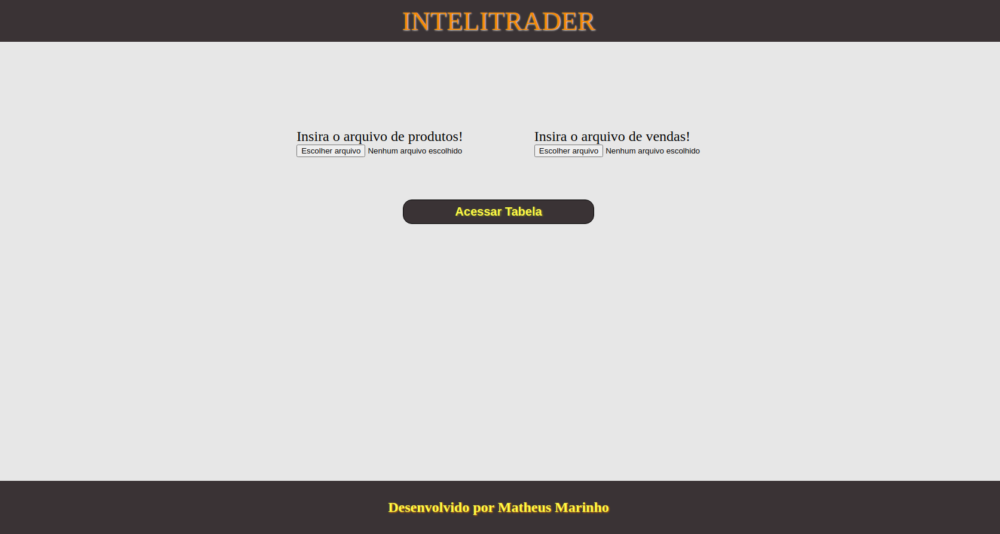
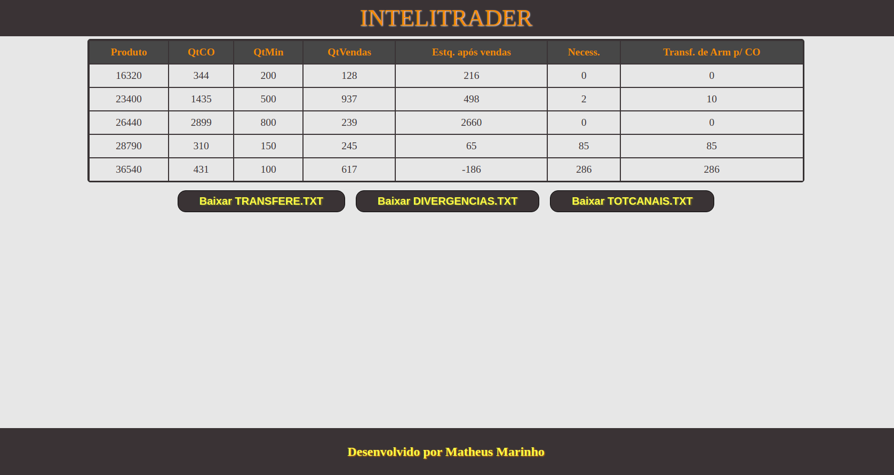
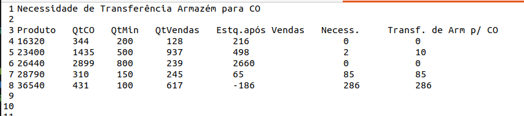

# Desafio Intelitrader

## Link para a aplicação

- https://processo-seletivo-intelitrader.vercel.app/

## Objetivo do projeto
Receber um arquivo contendo o estoque atual dos produtos e um arquivo contendo o histórico das vendas realizadas, analisar os arquivos e definir divergências nos arquivos, quantidade de vendas separadas por canais de venda e organizar a necessidade de transferência do armazém para o centro de operações. 

## Descrição do projeto

Na tela inicial temos dois locais para inserir os arquivos desejados de vendas e produtos, ao inseri-los é só clicar no botão de ver tabelas para ir para a próxima página.

Já na tela principal, temos os botões para baixar os arquivos necessários e uma tabela que mostra o controle de vendas após analisar os arquivos inseridos na página anterior.

E ao clicar em algum dos botões é feito o download do arquivo desejado, segue abaixo um exemplo feito com o arquivo de transferências.

## Como visualizar o projeto localmente

1- Via url - https://processo-seletivo-intelitrader.vercel.app/

2- Via node
- Clone o repositório através do comando "git clone git@github.com:matheusnff85/processo-seletivo-intelitrader.git"
- Instale as dependências com o comando "npm install"
- Por fim utilize o comando "npm start" e abra o link retornado pelo terminal em seu navegador

## Desenvolido por Matheus Marinho
-Github: https://github.com/matheusnff85
-Linkedin: https://www.linkedin.com/in/matheus-marinhodsp/

